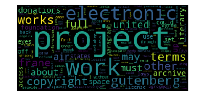

## Word Cloud
For this project, I created a "word cloud" from a text by writing a script.  
This script needs to process the text as an input, then
count the frequencies.  
A dictionary is the output of the calculate_frequencies function.  
The wordcloud module will then generate the image from your dictionary.  

### YOU NEED TO:
* Remove punctuation
* Ignore uninteresting or irrelevant words
* Ignore case and words that do not contain all alphabets

### About Input
For the input text of your script, you will need to provide a file that contains text only.  
For the text itself, you can copy and paste the contents of a website you like.  
Or you can use a site like Project Gutenberg to find books that are available online.  
You could see what word clouds you can get from famous books, like a Shakespeare play or a novel by Jane Austen.  
Save this as a .txt file somewhere on your computer.


### Installs & Import
Here are all the installs and imports you will need for your word cloud script.
```
pip install wordcloud (install)

import wordcloud
import numpy as np
from matplotlib import pyplot as plt
from IPython.display import display
import io
import sys
import os
```
### Upload a text file

```
file = open("b.txt", "r")
file_contents = file.read()
f.close()
```

### Results:

<center>
   
</center>
